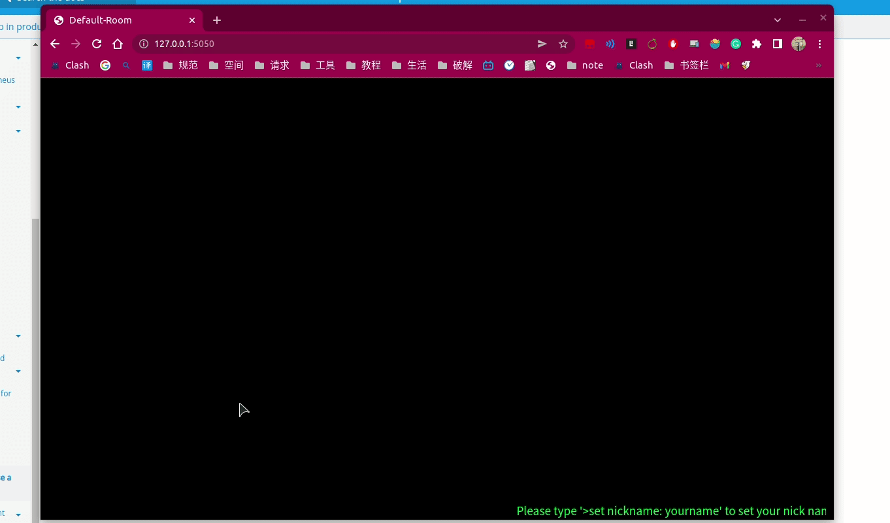

### 项目介绍
---
> **项目开发目的:** 本项目是在上班之余，使用 Typescript & Node & Express开发出来的一款简约的即时聊天系统，并且默认的聊天主题采用黑色命令行界面，方面您[默认您从事软件开发行业]在上班不便打开微信的情况下，能随时和其他同事一起摸yu[脱敏处理已是日常]夸天
    
> **项目特点:**
1. 本项目采用 [fingerprintjs](https://fingerprintjs.com/)提供的免费指纹生成组件，为每一个客户端( 浏览器)生成一个唯一识别码， 从而达到服务器端可记住每一台客户端的功能.
2. 本项目采用 `内存数组(HashMap)` 代替数据库的方案，使项目极致轻量化，同时没有数据持久化也意味着服务器端不存储数据，所以有存储数据需求的可以读到这里便离开.
3. 本项目属于匿名聊天系统，不进行任何实名校验，服务器端暂时也没有设置任何文字脱敏处理， 所以请恪守当地法律法规，本项目将不承担任何相关责任.
4. 项目采用开源项目[Push.js](https://pushjs.org/)的消息弹窗组件，在用户允许通知的情况下可实现新消息弹窗提醒的功能.
5. 项目当中集成了简单的截图分享，本地图片文件选择上传分享的功能，目前尚不支持更多格式文件分享的功能.
6. 项目有切换房间等功能，（在房间名不易雷同的情况下）可以实现类似`私密`聊天的需求，所有的聊天室数据均放置在内存当中，聊天室不随项目启动创建， 但随着项目停止而销毁.
7. 项目采用类似命令的方式来实现一些功能的设置，比如切换背景图， 发送图片之类的功能.
    
> **特别注意:** 
1. 请勿在项目中发送重要（个人隐私/财产等）数据
2. 项目聊天框存在js注入风险，后台未做相关拦截处理，适合友好型聊天环境

### 运行截图
---
> **部署成功** 
> **设置昵称** 
> **发送消息和发送照片** 
> **清除聊天记录** 
> **切换房间以及退出** 
> **切换背景图** 

### 部署方案
---
> **部署前准备:**
1. 作为单体应用，需要项目中前后端配置好对应的 ws 与 http 服务链接地址， 
    > 前端页面中配置地址 “im/public/init.js” 的 32 & 64 行 以及 “im/public/con_wss.js” 的 第 4 行
    > 后端配置 HTTP_PORT 环境变量可设置 Http 服务的端口， websocket 的默认端口是 5151, 没有暴露为变量， 可自行全局搜索后更改

> **部署:**
1. docker 部署： 可在更改变量配置完成之后进入 im 目录直接运行 `docker build -t im-page:v0.0.3 .` 命令，将其构建成为 docker image ， 随后执行 `docker run --name myim -p 5050:5050 -p 5151:5151 im-page:v0.0.3` 运行 imaga， 注意更改相关的端口！ 访问 http://127.0.0.1:5050 如果出现相关界面则代表部署成功.
2. 直接部署: 修改变量完成之后， 直接在 im 目录下先执行`npm i` 安装以来，再执行 `npm run start` 即可，访问 http://127.0.0.1:5050 如果出现相关界面则代表部署成功

### 功能命令说明
---
> **设置昵称：** `>setnickename: 张三`

> **清除当前页面聊天记录：** `>clear`

> **发送本地图片：** `>sendimg:`

> **切换房间：** `>switchroom: 魔仙堡`

> **退出房间：** `>exit` | `>switchroom: default-room`

> **切换壁纸：** `>changebg:4` 0-9 都有对应的壁纸， 随心选择

> **切换到默认壁纸：** `>changebg: def`  

